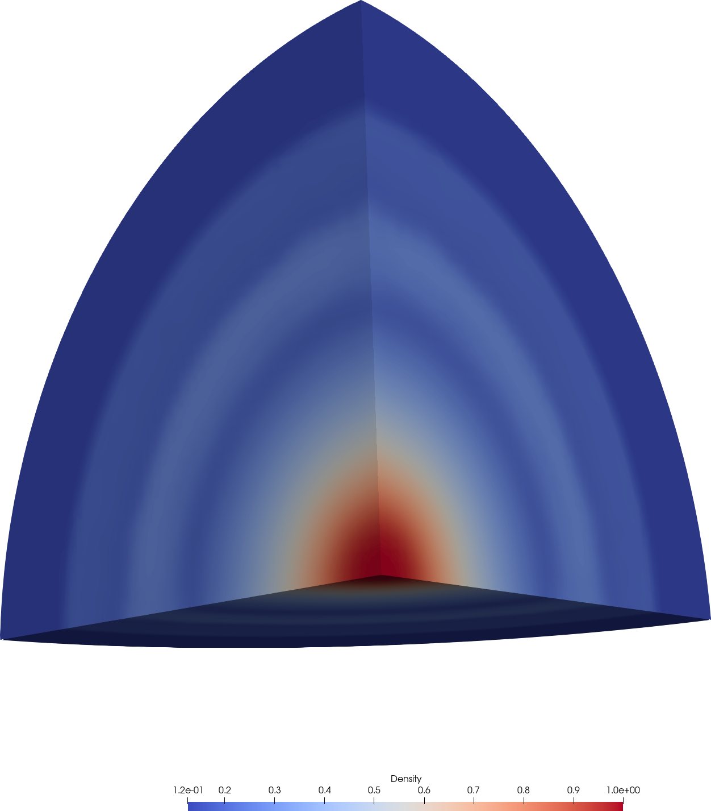
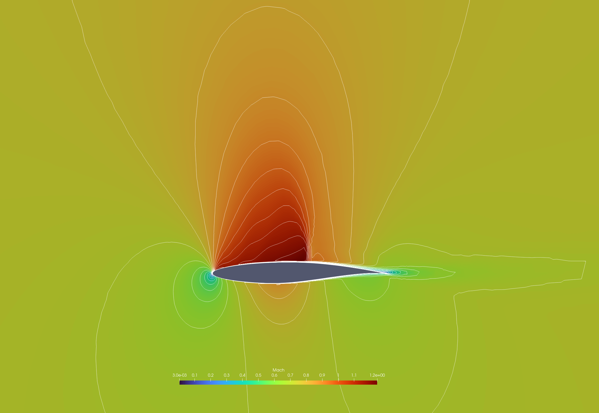
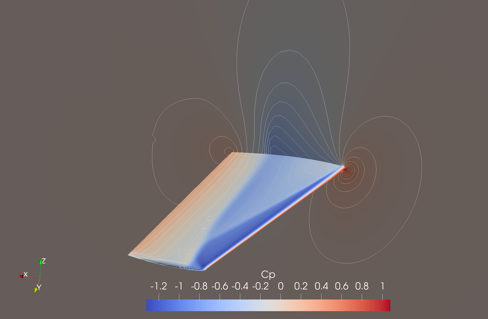
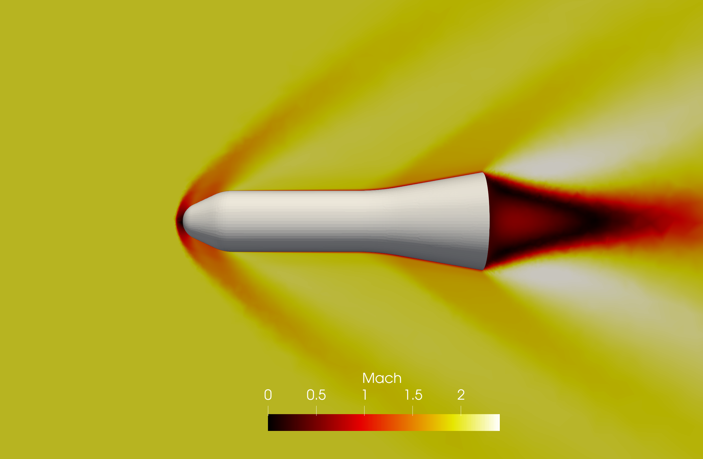

**********
Examples
**********

Three-dimensional explosion problem
===================================
This example is an extension of the shock-tube problem to a three-dimensional sphere. The details of the flow configuration can be found in `this paper <https://doi.org/10.1016/j.compfluid.2012.04.015>`_. The procedures to obtain an unsteady solution are presented as follows:

1. Convert mesh::

    user@Computer ~/pyBaram$ pybaram import explosion.cgns explosion.pbrm

2. Partitioning mesh::

    user@Computer ~/pyBaram$ pybaram partition 4 explosion.pbrm explosion_p4.pbrm

3. Running parallel simulation::

    user@Computer ~/pyBaram$ mpirun -n 4 pybaram run explosion_p4.pbrm explosion.ini

4. Convert VTK output file for visualization::

    user@Computer ~/pyBaram$ pybaram export explosion_p4.pbrm out-0.25.pbrs out.vtu

5. Visualizing the solution with Paraview, you can obtain following result.

   Density contour of explosion problem

Transonic flow over RAE2822 airfoil
===================================
One of the famous benchmarks involves solving transonic flow over an airfoil. Detailed flow conditions can be obtained from the `NPARC validation page <https://www.grc.nasa.gov/www/wind/valid/raetaf/raetaf.html>`_.
The mesh file is obtained from the `SU2 tutorial page <https://su2code.github.io/tutorials/Turbulent_2D_Constrained_RAE2822/>`_. The procedures to obtain a steady-state solution are presented as follows:

1. Convert mesh::

    user@Computer ~/pyBaram$ pybaram import rae2822.cgns rae2822.pbrm

2. Running simulations::

    user@Computer ~/pyBaram$ pybaram run rae2822.pbrm rae2822.ini

3. Convert VTK output file for visualization::

    user@Computer ~/pyBaram$ pybaram export rae2822.pbrm out-10000.pbrs out.vtu

4. Visualizing the solution with Paraview, you can obtain following result.

   Mach contour of flow over RAE2822 airfoil

Transonic flow over ONERA M6 wing
=================================
This is a well-known benchmark for solving transonic flow over a three-dimensional wing. Detailed flow conditions can be obtained from the `NASA Turbulence Modeling Resource <https://turbmodels.larc.nasa.gov/onerawingnumerics_val.html>`_. The mesh file is generated using the provided code from the same webpage, allowing for the creation of a series of mixed meshes. You can download medium and fine mesh files from the link provided in the `examples` folder. Due to the substantial size of the provided mesh files, it is recommended to run this case on a cluster machine. The procedures to obtain a steady-state solution are presented as follows:

1. Convert mesh::

    user@Computer ~/pyBaram$ pybaram import wing_mixed_ph.3.cgns wing_mixed_ph.3.pbrm

2. Partitioning mesh::

    user@Computer ~/pyBaram$ pybaram partition 16 wing_mixed_ph.3.pbrm wing_mixed_ph.3_p16.pbrm

3. Running parallel simulation::

    user@Computer ~/pyBaram$ mpirun -n 16 pybaram run wing_mixed_ph.3_p16.pbrm oneram6.ini

4. Convert VTK output file for visualization::

    user@Computer ~/pyBaram$ pybaram export wing_mixed_ph.3_p16.pbrm out-20000.pbrs out.vtu

5. Visualizing the solution with Paraview, you can obtain following result.

   Pressure contour of ONERA M6 wing surface

Supersonic flow over HB-2 model
=================================
The HB-2 model is a standard test case for an axisymmetric body. Detailed flow conditions and experimental data can be obtained from the `AEDC technical report <https://apps.dtic.mil/sti/pdfs/AD0412651.pdf>`_. You can download the mesh file from the link provided in the `examples` folder. Due to the substantial size of the provided mesh file, it is recommended to run this case on a cluster machine. The procedures to obtain a steady-state solution are presented as follows:

1. Convert mesh::

    user@Computer ~/pyBaram$ pybaram import hb2.cgns hb2.pbrm

2. Partitioning mesh::

    user@Computer ~/pyBaram$ pybaram partition 16 hb2.pbrm hb2_p16.pbrm

3. Running parallel simulation::

    user@Computer ~/pyBaram$ mpirun -n 16 pybaram run hb2_p16.pbrm hb2.ini

4. Convert VTK output file for visualization::

    user@Computer ~/pyBaram$ pybaram export hb2_p16.pbrm out-5000.pbrs out.vtu

5. Visualizing the solution with Paraview, you can obtain following result.

   Mach contour around HB-2 model at :math:`M=2.0`.